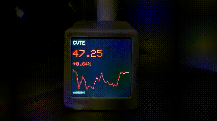
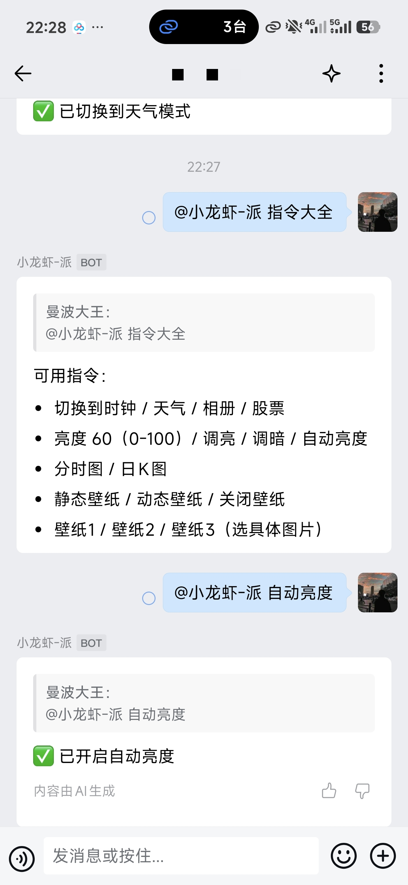
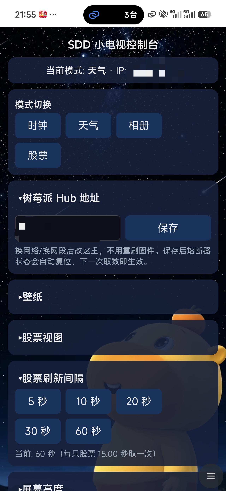
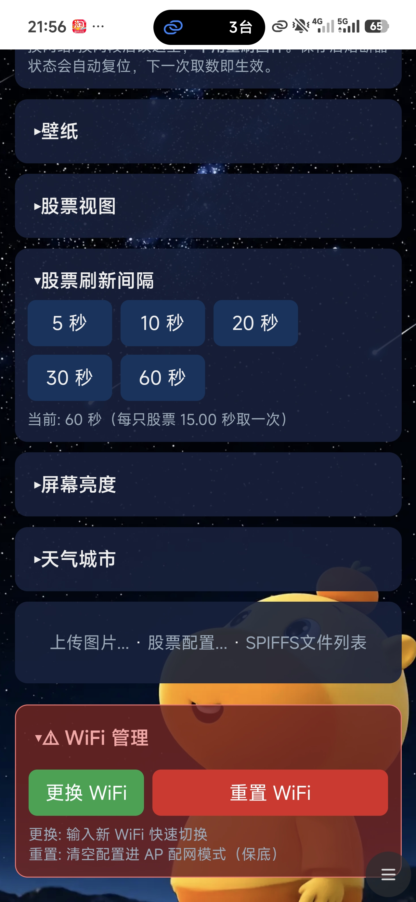

**License: Apache‑2.0**

> 主仓库 [GitHub](https://github.com/LY-1157799217/mqtt-edge-hub)
> 国内镜像访问：[Gitee](https://gitee.com/LY115LY/mqtt-edge-hub)
> 两个仓库保持同步更新，国内访问建议使用 Gitee 镜像。

> 这是面向**局域网**的桌面信息显示与设备控制原型。树莓派提供数据接口、缓存和行情阈值监控，
> 通过本机 MQTT 总线连接企业微信机器人与指令执行器；树莓派掉线时，ESP32‑C3「小电视」
> 可**兜底直连**上游取数并显示（协议分路，见亮点 5）。
> 本仓库**同时包含两侧代码**：Pi（Linux）侧在仓库根目录，ESP32 侧固件在 `firmware/`。

> **📌 该选哪个版本？**
> - **有树莓派** → 用本版（**Pi Hub 版**）：树莓派当常开中控，小电视只管显示。
> - **手头没有树莓派** → 用 **无Pi版**：[GitHub](https://github.com/LY-1157799217/Visual-desktop-TV-decoration) ｜ [Gitee](https://gitee.com/LY115LY/Visual-desktop-TV-decoration)。一块 ESP32‑C3 + 一个 USB 充电头，开箱即用。
>
> 两版**共用同一套显示端硬件与外壳**，主要区别在"数据从哪来"。详细对照见下方
> [**📊 与无Pi版的区别**](#-与无pi版的区别)。

# mqtt-edge-hub — 树莓派中控 + ESP32-C3 桌面行情屏显

## ✨项目亮点

1. **树莓派当常开中控，ESP32 只管显示与兜底** —— 分工干净：行情缓存、告警判定、企微通道都在 Pi 侧
2. **Pi 侧集中缓存**：行情/日K/天气按各自 TTL 缓存在 SQLite。行情是"过期即刷新、
   **刷新失败返回错误**"，不做陈旧值兜底（日K 与天气的降级行为不同，见下方"已知限制"）
3. **企业微信双向**：**行情阈值提醒**主动推手机；在群里发消息就能**控制小电视**（切模式、调亮度、换壁纸）
4. **MQTT 解耦**：告警、指令、回执三条流解耦，并为将来的传感器设备预留了 `hub/sensor/+/+` 主题
5. **设备侧自动兜底**：树莓派不可达时，小电视**自己直连上游**。协议是**分路的**：
   行情、天气走**明文 HTTP**；日K、分时走 **HTTPS 但 `setInsecure()` 跳过证书校验**
   （只防窃听、不防中间人）。并在满足条件时**补取分时图**（`DIRECT_SPARK_BACKFILL`）
6. **支持网页改 Hub 地址**：设备地址可在网页控制台修改并存入 NVS，**换网络后不用重刷固件**
7. **开机自启**：4 个 pihub 服务随系统启动（实测各进程约 26 秒就绪，**端到端可用时间另计**，见下）
8. **安全边界写明白**：MQTT 只绑回环、凭证只进 `.env`、并**如实披露**设备网页与企微会话的权限模型
9. **跨复位取证**：串口会丢行，用 `RTC_NOINIT_ATTR` 面包屑保留死前阶段与堆水位，崩溃计数剔除烧录复位干扰


## 🧾硬件BOM清单

| 部件 | 说明 |
|---|---|
| 主控 | ESP32‑C3 |
| 屏幕 | SPI 接口 TFT 彩屏（ST7789 240×240） |
| 供电 | Type‑C USB 供电 |
| **树莓派** | **★ 本版必需 ★** 任意能跑 Linux + Python 3 的型号（3B+ / 4 / 5 / Zero 2W 均可），需能常开 |

> ⚠️ **本版要两块硬件**：树莓派当常开中控，ESP32‑C3 当显示端，两者缺一不可。
> **只想桌上摆一块行情屏、不想要额外主机** → 请改用
> [**无Pi版**](https://github.com/LY-1157799217/Visual-desktop-TV-decoration)（国内 [Gitee 镜像](https://gitee.com/LY115LY/Visual-desktop-TV-decoration)）。

## 📊 与无Pi版的区别

| | **Pi Hub 版（本仓库）** | **无Pi版** |
|---|---|---|
| 需要什么 | ESP32‑C3 **+ 树莓派（常开）** | 只要 ESP32‑C3 |
| 数据链路 | 设备 → 树莓派 → 上游 | 设备 → 上游（直连） |
| 缓存 | Pi 侧 SQLite 按接口 TTL 缓存 | 设备内存里保存"上一次的数据" |
| 企业微信 | **双向**：阈值提醒推送 **+** 群内发指令控制设备 | 无 |
| 行情阈值提醒 | **有**（接近涨跌停 / 日涨跌幅超阈值） | 无 |
| 上游抖动时 | 连不上 Pi 就整段走直连兜底（见"已知限制"） | 每次都要设备自己重试 |
| 功耗 / 成本 | 多一台常开的树莓派 | 一个 USB 充电头即可 |
| 换网络后 | 设备侧 Hub 地址网页可改，不用重刷 | 同 |
| **适合谁** | 已经有树莓派、想要**提醒**和**远程控制** | 只想桌上摆一块行情屏 |

> 两版是**姊妹项目**，共用同一套硬件接线与显示端基础；选型只取决于**你有没有树莓派、要不要企微提醒**。

## 🤖开发模式说明

本项目采用 AI‑Native 人机协同开发工作流：

- 使用 Claude Code、OpenClaw 承担代码生成、排错调试、文档初稿、工程结构梳理；
- **Windows + Linux 跨系统协同**，构建多 AI Agent 协同方案；
- 人负责主导跨系统协作、需求定义、信息审核同步、BUG 排查定位、硬件实物验证、
  业务逻辑取舍、优化方向裁决、核心代码审查、功能实测；
- **核心业务逻辑、硬件适配、系统架构均由人主导把控。**

与无Pi版相比，本版是**两侧（Pi + ESP32）协同**：HTTP 接口契约由两侧共同遵守，
改动一处需同步另一侧 —— 契约完整收录在下方「接口契约」一节。

> 注：本项目仅供展示与学习，不构成投资或气象决策依据！

## 拓扑

系统只有三类数据流，彼此独立 —— 分开画比一张交叉的方框图好读。

```
【一、取数】设备 → API → 上游

   ESP32-C3 ──HTTP /api/stock/*、/api/weather/*──► pihub-api ──► 上游
   小电视                                          Flask :5000   （按接口 TTL 缓存）
                                                   + SQLite

   ESP32-C3 ──HTTP / HTTPS 直连上游──────────────────────────────► 上游
              （仅当 Pi 取数失败时兜底，见亮点 5）

【二、告警】监控 → 上游（独立于 API）→ 企微

   pihub-monitor ──轮询──────────────────────────────────────────► 上游
   阈值告警判定     （不经 API、不写行情缓存）
        │
        └──publish hub/alert/stock/*──► pihub-wecom-bot ──► 企微群 / 手机

【三、指令】企微 → Bot → devctl → API → 设备

   企微群 ──长连接──► pihub-wecom-bot
                          │ publish hub/command/smalltv
                          ▼
                     pihub-devctl ──HTTP /api/control/*──► pihub-api
                     指令执行器                              （Flask 转发）
                                                                  │ HTTP /set
                                                                  ▼
                                                             ESP32-C3 小电视
```

```
   Mosquitto :1883 (仅绑 127.0.0.1) ── 指令 / 告警总线（上面二、三两类的中间站）
   SQLite data/pihub.db (WAL)      ── 缓存与配置
```

> **两条上游路径互不相干**：`pihub-monitor` 直接打上游、**不写行情缓存**；
> `pihub-api` 只在被请求时按需刷新自己的缓存。两者不共享采集结果 ——
> 同一只股票在两处各取一次。这样设计是为了让监控不被接口请求阻塞，
> 代价是上游调用量与缓存不复用。

## 目录结构

```
app/               Pi 侧 Python（Flask API + 监控线程 + 指令执行器 + 企微 Bot）
  api.py           Flask HTTP 服务（接口契约；绑 0.0.0.0，免疫换 IP）
  monitor.py       行情轮询 + 阈值告警（默认 1h 冷却去重）
  devctl.py        MQTT 指令总线执行器（hub/command/smalltv -> ESP32 /set）
  wecom_bot.py     企微 Bot：告警推送 + 接收群指令（长连接 API）
  command.py       指令解析（单一来源）
  config.py        配置读取（env > .env > SQLite config 表 > 默认值）
  cache.py         SQLite 缓存层
  datasource.py    上游数据源（腾讯行情/K线、天气）
  init_db.py       建库脚本
  schema.sql       表结构
config/           Mosquitto 安全边界配置样例（装到 /etc/mosquitto/conf.d/）
systemd/          4 个 systemd 服务单元（Mosquitto 本身由系统包提供，不在此目录）
firmware/
  integrated-balance/      ESP32-C3 Arduino 工程（目录名与主文件同名，IDE 要求）
    integrated-balance.ino   主固件
    TFT_eSPI_Setup.h         屏幕驱动配置（覆盖到 TFT_eSPI 库的 User_Setup.h）
    font/ font_alpha/        数字字体素材
    img/                     天气图标素材
    data/                    SPIFFS 内容（默认壁纸，需单独上传）
acceptance_s9.sh  基础服务检查脚本（baseline/check 两模式；非整机验收）
.env.example      环境变量样例（真实 .env 不进 git）
requirements.txt  Python 依赖
LICENSE           Apache-2.0
```

> ℹ️ **代码注释里出现的 `PERFORMANCE.md` / `PI_HUB_SPEC.md` 是什么？**
> 它们是开发期使用、**不随本仓库发布**的两份内部文档。注释引用它们是为了保留
> "当时为什么这么改"的依据，**不影响编译与运行**。

## 第零步：硬件引脚

| 信号 | GPIO | 备注 |
|---|---|---|
| SCL | 3 | SPI 时钟 |
| SDA | 4 | SPI MOSI |
| DC | 2 | |
| RST | 5 | |
| BL | 1 | AO3401 P‑MOS，**低电平点亮** |
| CS | — | 屏端接地，固定选中 |
| USB | 18/19 | 原生 USB，Type‑C 直刷 |

> 以 `firmware/integrated-balance/TFT_eSPI_Setup.h` 为准。花屏/无显示时优先检查它是否已覆盖到库目录。

## 第一步：布置树莓派（Pi 侧）

**依赖**：`python3`、`python3-venv`、`sqlite3`、`mosquitto`、`mosquitto-clients`（Debian/Raspberry Pi OS）。

```bash
# 0. 系统依赖（sqlite3 是命令行工具，第三步配自选股要用）
sudo apt update && sudo apt install -y python3-venv sqlite3 mosquitto mosquitto-clients

# 1. 取代码（二选一），放到与 systemd 单元一致的固定目录
#    git clone <本仓库地址> /home/pi/cooperate/pihub
cd /home/pi/cooperate/pihub

# 2. 虚拟环境 + Python 依赖
python3 -m venv .venv
.venv/bin/pip install -r requirements.txt

# 3. 环境变量
cp .env.example .env
#   编辑 .env 填入 WECOM_CORP_ID / WECOM_BOT_ID / WECOM_BOT_SECRET
#   ⚠️ .env 权限建议 600：chmod 600 .env

# 4. 建库
.venv/bin/python app/init_db.py

# 5. ⚠️ 建日志目录 —— systemd 单元写 logs/*.log，目录不存在会起不来
mkdir -p logs data

# 6. 安装 systemd 服务
sudo cp systemd/*.service /etc/systemd/system/
sudo systemctl daemon-reload
sudo systemctl enable --now mosquitto pihub-api pihub-monitor pihub-devctl pihub-wecom-bot
```

> **关于运行用户与时区**
> - 4 个单元里写死了 `User=pi` / `Group=pi` 与 `/home/pi/cooperate/pihub` 路径。
>   换成别的用户/目录时，**要同步改单元里的 `User`、`Group`、`WorkingDirectory`、`ExecStart`、`Environment`**
>   （不只是路径），并确保该用户对 `logs/`、`data/` 有写权限。
> - 监控线程按**本地时间**判断交易时段，请确认时区为 `Asia/Shanghai`：
>   `timedatectl` 查看，`sudo timedatectl set-timezone Asia/Shanghai` 设置。

> Mosquitto 需额外加安全边界配置（仅本机监听）：
> ```bash
> sudo cp config/mosquitto-pihub.conf /etc/mosquitto/conf.d/pihub.conf
> sudo systemctl restart mosquitto
> ```

## 第二步：烧录 ESP32‑C3

### 2.1 开发板与分区

用 Arduino IDE 打开 `firmware/integrated-balance/integrated-balance.ino`：

```text
开发板：ESP32C3 Dev Module
分区方案：No OTA (2MB APP / 2MB SPIFFS)
USB CDC On Boot：Enabled
```

### 2.2 ⚠️ 开发板核心必须是 Arduino‑ESP32 **2.x**（本工程实测 2.0.4）

**不要用 3.x。** 固件的背光调光用的是 `ledcSetup()` / `ledcAttachPin()` / `ledcWrite(channel, duty)`，
这是 2.x 的 LEDC API；3.x 已改为 `ledcAttach(pin, freq, res)` / `ledcWrite(pin, duty)`，
用 3.x 编译会直接报错（`ledcSetup` was not declared）。

这里的"核心"指 **开发板支持包**，在 **开发板管理器（Boards Manager）** 里搜
`esp32 by Espressif Systems` 安装 —— **它不在库管理器里**，所以按名字在库里搜是找不到的。

> 确认已装版本的两种方法：
> - Arduino IDE：**工具 → 开发板 → 开发板管理器**，搜 `esp32` 看已安装版本；
> - 直接看目录（Windows 默认）：`%LOCALAPPDATA%\Arduino15\packages\esp32\hardware\esp32\<版本号>\`
>   —— 本工程用的是 `...\hardware\esp32\2.0.4\`。

### 2.3 第三方库

下表版本取自**本工程实际编译通过的那套环境**（Arduino IDE 的 `Documents/Arduino/libraries`）：

| 库 | 用途 | 实测版本 |
|---|---|---|
| **TFT_eSPI** | 屏幕驱动 | **2.5.43** |
| **ArduinoJson** | 解析上游 JSON | **6.21.5**（6.x / 7.x 均可，见下） |
| **WiFiManager** | 网页配网（AP 保底） | **2.0.17** |
| **ESPAsyncWebServer** | 异步网页控制台 | **3.12.0** |
| **AsyncTCP** | 上者的依赖（ESP32 版） | **3.5.0** |
| **TJpg_Decoder** | 壁纸 JPEG 解码 | **0.0.3** |

> **`ESPAsyncWebServer` 与 `AsyncTCP` 是一对**，同为 **ESP32Async** 维护的 3.x 线，请装同一大版本，
> 且**先装 `AsyncTCP` 再装 `ESPAsyncWebServer`**（后者依赖前者）。
>
> **关于 `ArduinoJson` 大版本**：固件用的是 v6 风格的 `StaticJsonDocument<...>` /
> `DynamicJsonDocument doc(...)`。6.x 原生支持；7.x 仍通过其 `compatibility.hpp`
> 兼容这两个类（编译时会打 `deprecated` 警告），因此 **6.x 与 7.x 都能编过** ——
> 实测 6.21.5（Arduino IDE）与 7.4.3（PlatformIO）均可用。
>
> 其余（`WiFi` / `SPIFFS` / `HTTPClient` / `WiFiClientSecure` / `Preferences` / `Arduino.h` 等）
> 随开发板支持包自带，**无需另装**。

### 2.4 四个前置步骤

1. **屏幕驱动配置**：把 `firmware/integrated-balance/TFT_eSPI_Setup.h`
   覆盖到 TFT_eSPI 库目录下的 `User_Setup.h`（引脚、驱动、SPI 参数都在里面）。
2. **编译上传** `integrated-balance.ino`。
3. **上传 SPIFFS 素材**（默认壁纸在 `.../data/`）：用 Arduino ESP32 的
   *Sketch Data Upload* 工具选 **`firmware/integrated-balance/`** 目录上传；否则相册模式无图可显示。
4. **配网 + 填 Hub 地址**：设备首次上电或重置后开热点 **`SDD小电视`** →
   连上后打开 `192.168.4.1` 配网 → 再到网页控制台最下方「**树莓派 Hub 地址**」
   填树莓派的局域网 IP（如 `192.168.1.100`）。
   > ⚠️ 固件里**没有**预设的 Pi 地址（留空 = 未配置）。不填则设备始终走直连兜底。

## 第三步：首次部署必做（否则"屏幕有数、企微不工作"）

> 这三件事**需手工完成**，安装流程不会代做。跳过它们，各服务仍显示为正常运行，
> 但企微控制与阈值告警不会工作。

**① 告诉树莓派「小电视在哪」** —— 企微控制/指令需要它：

```bash
# 推荐：写进 .env（优先级：环境变量 > .env > SQLite config > 默认值）
echo 'smalltv_ip=192.168.1.100' >> .env      # ← 换成你设备的实际 IP
sudo systemctl restart pihub-devctl pihub-api
```

> **另一种填法**（写数据库，不用重启服务）——`Content-Type` 头**不能省**，
> 少了它 Flask 解析不出 JSON，会退回去用请求来源地址，从本机调用就是 `127.0.0.1`，
> 而接口明确拒绝回环地址，直接返回 400：
> ```bash
> curl -X POST http://127.0.0.1:5000/api/esp32_ip \
>      -H 'Content-Type: application/json' \
>      -d '{"ip":"192.168.1.100"}'
> ```
> ⚠️ **两条路不要混用**：取值优先级是 `环境变量 > .env > SQLite config > 默认值`，
> 所以**只要 `.env` 里已经有非空的 `smalltv_ip`，上面这条 curl 写进数据库也不会生效**（被 `.env` 盖住）。
> 两条路选一条走到底；改动后重启 `pihub-api` 与 `pihub-devctl` 使其生效。
>
> ⚠️ **当前固件不会自动上报自己的 IP**，必须手工填一次。

**② 告诉监控线程「盯哪些标的」** —— 不配就**永远不会有告警**：

```bash
sqlite3 data/pihub.db "INSERT OR REPLACE INTO symbols(symbol,label,kind,sort,enabled)
  VALUES ('sh600519','贵州茅台','stock',0,1),
         ('sz000725','京东方A','stock',1,1),
         ('sh000001','上证指数','index',2,1);"
sudo systemctl restart pihub-monitor
```

> ⚠️ **显示名单 ≠ 告警名单**：小电视上轮播哪几只，是在**设备网页**里配的；
> 监控盯哪几只，是在**Pi 的 `symbols` 表**里配的。两者互不同步，各配各的。
> **改完 `symbols` 必须重启 `pihub-monitor`** —— 它只在启动时读一次。

**③ 在企微群里 @ 一次机器人** —— 机器人只能向"用户曾主动发过消息"的会话推送：

```
@你的机器人 帮助
```

## 服务一览（4 个 pihub 服务 + Mosquitto，均应 enabled+active）

| 服务 | 作用 | 绑定 |
|---|---|---|
| `mosquitto` | MQTT broker（指令/告警总线） | `127.0.0.1:1883`（不对外） |
| `pihub-api` | Flask HTTP 服务（ESP32 拉数据接口） | `0.0.0.0:5000` |
| `pihub-monitor` | 行情轮询 + 阈值告警 | 出站 |
| `pihub-devctl` | 指令总线执行器 → ESP32 `/set` | 出站（走回环访问 Flask） |
| `pihub-wecom-bot` | 企微推送 + 指令接收 | 出站长连接 |

控制：`sudo systemctl status|restart pihub-api` 等。日志：`logs/*.log` 或 `journalctl -u pihub-api`。

## ★ 开机启动时序（实测）

**测试环境**：树莓派（`docker.service` 同时启用）、Raspberry Pi OS、4 个 pihub 服务 `Type=simple`。
**判据**：`systemd-analyze` / `journalctl -b` 里各单元出现 `Started`。

```
t=0            kernel / sysinit
+1.7s          basic.target
+2.4s          NetworkManager
+2.9s          network.target
+18s           mosquitto.service          Started  ← MQTT broker 就绪
+26s           pihub-api.service          Started  ← Flask 进程起（After mosquitto）
+26s           pihub-monitor.service      Started
+26s           pihub-devctl.service       Started  ← After pihub-api
+26s           pihub-wecom-bot.service    Started
+1m14s         graphical.target
```

依赖链（来自各 unit 的 `After=`）：
- `pihub-api` / `pihub-monitor` / `pihub-wecom-bot` ← `After=network-online.target mosquitto.service`
- `pihub-devctl` ← `After=network-online.target mosquitto.service pihub-api.service`
- 全部 `WantedBy=multi-user.target`

> ⚠️ **"Started" ≠ "端到端可用"。** 它只表示进程起来了：HTTP 是否已 `listen`、
> 企微长连接是否已订阅成功、到设备的链路是否已收敛，都要另测。
> **实测现象**：树莓派重启后的**头一两分钟**，企微指令可能返回失败
> （设备/网络链路尚未收敛），**等一会儿会自愈**，无需任何操作。

关键路径在本机由 `docker.service`（~54s）主导，故 `graphical.target` 到 ~1m14s；
四个pihub服务+Mosquitto在 ~26s（mosquitto 之后）即全部 active，不受 docker 阻塞。

查看：`journalctl -b | grep -E "pihub|mosquitto"` 或 `systemctl list-units --type=service | grep pihub`。

## 接口契约（ESP32 ↔ Pi，改动需两侧同步）

通用规则：

- 一律 **HTTP，不用 HTTPS**（局域网内，且让 ESP32 彻底摆脱 TLS 内存开销）
- 一律 **`Connection: close`，不用 chunked 分块传输**（ESP32 的 HTTPClient 对 chunked 大响应会截断）
- **响应体顶层字段用扁平结构、不用嵌套对象**（ESP32 解析缓冲有限）。
  例外：日K 的 `kl` 是**二维数组**（`[[开,收,高,低], ...]`）；控制接口的**请求体**用 `{"params": {...}}` 包一层
- 响应体控制在 **4KB 以内**
- 失败返回 HTTP 非 200、body 可为空 —— ESP32 只看状态码

| 方法 | 路径 | 用途 |
|---|---|---|
| GET | `/api/stock/{symbol}` | 单只行情 + 分时（48 点） |
| GET | `/api/stock/{symbol}/kline` | 日 K（最多 30 组） |
| GET | `/api/weather/{city_code}` | 天气（9 位城市码） |
| POST | `/api/control/mode` | `{"mode":0..3}` 控制小电视模式 |
| POST | `/api/control/brightness` | `{"value":0..100}` 亮度 |
| POST | `/api/control/set` | 通用透传（白名单参数：`stockview`/`auto_brightness`/`wp`/`idx`） |
| POST | `/api/esp32_ip` | **登记设备 IP**（服务端提供，但**当前固件不会自动调用**，见第三步 ①） |

**两个容易配错的地方**：

1. **日 K 每组 4 个数的顺序是 `[开, 收, 高, 低]`** —— 是设备端绘图代码的顺序，
   **不是**常见的 OHLC（开高低收）。
2. **`spark` 固定 48 个 float，按「已有点数等距抽样」**（`index = round(i*N/48)`，越界取末值），
   不是按 09:30–15:00 时间轴切分。按时间轴切分会让图形变成一条贴底直线。

## MQTT 主题约定

监控线程 publish，企微 Bot 与 devctl subscribe。**ESP32 不参与 MQTT。**

| 主题 | 方向 | payload | 状态 |
|---|---|---|---|
| `hub/alert/stock/limit_up` | 监控 → 企微 | `{"symbol","label","price","pct"}` | ✅ 已实现 |
| `hub/alert/stock/limit_down` | 监控 → 企微 | 同上 | ✅ 已实现 |
| `hub/alert/stock/surge` | 监控 → 企微 | 同上 + `"threshold"` | ✅ 已实现 |
| `hub/alert/weather/warning` | — | `{"city","level","text"}` | ⚠️ **仅预留，未实现** |
| `hub/command/smalltv` | 企微 → devctl | `{"action","value"}` | ✅ 已实现 |
| `hub/command/smalltv/ack` | devctl → 企微 | `{"ok","msg",...}` | ✅ 已实现 |
| `hub/sensor/+/+` | 预留 | — | ⚠️ 未实现 |

QoS 1；告警类**不设 retained**（避免重启后重推昨天的涨停）。

## 告警规则（`app/monitor.py`）

| 类型 | 判据 | 默认阈值 |
|---|---|---|
| 接近涨停 | 当日涨跌幅 ≥ 阈值 | 主板 `9.8`；创业板 `sz30*` / 科创板 `sh68*` 为 `19.8` |
| 接近跌停 | 当日涨跌幅 ≤ 阈值 | 主板 `-9.8`；创业板/科创板 `-19.8` |
| 异动 | `|当日涨跌幅|` ≥ 阈值 | `5.0` |

> ⚠️ **这是"按涨跌幅阈值判断"，不是真正的涨跌停判定**：
> - **ST 股（±5%）、北交所（±30%）未做适配** —— 尚未适配具体涨跌幅规则；
> - **未按 `kind` 排除指数**，指数若入 `symbols` 表也按同一阈值判定；
> - **"异动"是当日累计涨跌幅超阈值，不是盘中短时突变检测**。
>
> 阈值都存在 SQLite `config` 表里，可用 `sqlite3 data/pihub.db` 调整后重启 `pihub-monitor`。

## 企微指令速查

在企微群里 **@ 机器人**发消息即可（前缀会被自动忽略）。解析逻辑在 `app/command.py`，
**也可以直接在群里发「帮助」，机器人会把下面这份清单回给你**：

```text
可用指令：
- 切换到时钟 / 天气 / 相册 / 股票
- 亮度 60（0-100）/ 调亮 / 调暗 / 自动亮度
- 分时图 / 日K图
- 静态壁纸 / 动态壁纸 / 关闭壁纸
- 壁纸1 / 壁纸2 / 壁纸3（选具体图片）
```

同义词（关键词识别）：

| 指令 | 效果 |
|---|---|
| 时钟 / 时间 / 看钟 / clock | 切到时钟模式 |
| 天气 / weather | 切到天气模式 |
| 相册 / 照片 / 图片 / photo / album | 切到相册模式 |
| 股票 / 行情 / 股价 / stock | 切到股票模式 |
| 亮度 60（0–100） | 设为指定亮度 |
| 调亮 / 亮一点 / 变亮 | 亮度 +20 |
| 调暗 / 暗一点 / 变暗 | 亮度 −20 |
| 自动亮度 | 开启自动亮度 ⚠️ **企微只能开、没有"关"**；想关就发一条**指定亮度指令** 指定后默认关闭自动亮度 |
| 分时图 / 分时线 / 分时 | 切到分时图 |
| 日K图 / 日K / k线图 / K线图 | 切到日 K 图 |
| 静态壁纸 / 动态壁纸 | 切换壁纸模式 |
| 关闭壁纸 / 关壁纸 / 取消壁纸 | 关闭壁纸 |
| 壁纸1 / 壁纸2 / 第3张壁纸 / 图片2 | 选第 N 张静态壁纸（1–3） |
| 帮助 / 指令 / 怎么用 | 回这份帮助 |

## 符号规则

- 股票 / 指数：`sh600519` `sz000001` `sh000001`（上证指数）
- ⚠️ **场外基金（`f005827` 这类）当前不支持** —— Pi 侧数据源只按股票字段结构解析。
  无Pi版支持基金，两版在这一点上**不一致**。

## 上游数据源速查

以下均为**零门槛、免注册**的公开接口：

| 用途 | URL 模板 | 关键点 |
|---|---|---|
| 实时行情 | `http://qt.gtimg.cn/q={symbol}` | 返回 `~` 分隔的文本，非 JSON。字段索引：3=现价 4=昨收 31=涨跌额 32=涨跌幅 33=最高 34=最低 |
| 分时 | `https://web.ifzq.gtimg.cn/appstock/app/minute/query?code={symbol}` | JSON，路径 `data.{symbol}.data.data`，每行 `"0930 1355.00 227 30758500.00"`，空格分隔取第 2 段为价格 |
| 日 K | `https://web.ifzq.gtimg.cn/appstock/app/fqkline/get?param={symbol},day,,,{n},qfq` | 股票取 `data.{symbol}.qfqday`，**指数没有 qfqday，要取 `day`**。每行 `[日期,开,收,高,低,...]` |
| 天气 | `http://d1.weather.com.cn/weather_index/{city_code}.html` | 返回 **HTML 页面**，需截取 `dataSK = ` 到 `;var dataZS` 之间的 JSON |

反爬要点：腾讯系需 `Referer: http://gu.qq.com/`；天气网需 `Referer: http://www.weather.com.cn/`；
都需常规浏览器 UA；天气网 URL 建议带时间戳参数破缓存（`?_=<毫秒>`）。

> ⚠️ 第三方公开接口，**无官方文档、无 SLA，随时可能变更**。

## 交易日历与时段

- A 股交易时段：**09:30–11:30、13:00–15:00**，周一至周五；监控按本地时间判断
- 集合竞价 09:15–09:25：期间**只接受申报、不成交**，**09:25 集中撮合成交**并产生开盘价
- ⚠️ **节假日是硬编码名单**：`app/monitor.py` 顶部的 `HOLIDAYS` 目前手工维护了
  **2025 与 2026 两年**的 A 股休市日。
  **跨年后必须补充**，否则长假期间会空转、并可能推送陈旧数据。
  长期方案是接入上游交易日历（见路线图）。

## 疑难排查

| 现象 | 处理 |
|---|---|
| 企微回 **"执行失败（ESP32 返回 502）"** | 树莓派够不到设备。查：① `smalltv_ip` 是否已填且正确（第三步 ①）；② 设备是否在线；③ 见"开机头两分钟" |
| 企微回 **"设备忙（上一条指令执行中），已忽略"** | 设备正在整屏重绘，稍等再发 |
| 企微发指令**完全没反应** | 群里先 @ 一次机器人；`systemctl status pihub-wecom-bot` 看长连接是否已订阅 |
| **收不到任何告警** | ① `symbols` 表是否为空（第三步 ②）；② 改完是否重启了 `pihub-monitor`；③ 是否在交易时段 |
| 开机头一两分钟指令失败 | **已知现象**：树莓派刚重连网络，链路未收敛。等一会儿自愈 |
| 小电视显示 `--` / No Data | ① `pihub-api` 是否在 `:5000` 监听；② 设备是否已填对 Hub 地址 |
| 屏幕有行情但**分时图异常** | 设备可能走了直连兜底：直连的分时补取**有条件限制**（仅在 Pi 离线且处于分时视图时触发） |
| 花屏 / 无显示 | 确认 `TFT_eSPI_Setup.h` 已覆盖到库目录的 `User_Setup.h` |
| 服务起不来 | 先看 `logs/` 目录是否存在（第三步前置）；再 `journalctl -u pihub-api -n 50` |
| 设备反复重启但串口看不到报错 | 串口会丢行，"日志里没看到"不算证据。查串口 `[BOOT]` 行（含复位原因、累计崩溃、死前阶段与堆水位），或 `curl http://<设备IP>/status` |


## 已知限制与安全边界

**功能限制**（以下均为设计边界，不是故障）

- **行情缓存不做陈旧值兜底**：`/api/stock/*` 在缓存过期且上游刷新失败时**直接返回非 200**。
  设备随后的动作是分两段的：
  1. **先尝试直连上游**（即设备侧兜底，见亮点 5）——不是一失败就放弃。
  2. 当 Pi 取数与设备直连均失败、且已成功显示有历史数据时，屏幕可能继续显示旧值，目前没有明确的数据过期提示。
  只有从没成功过才会显示 `--` / No Data。日K 与天气的降级行为与此不同。
- **监控与 API 各自打上游**，不共享行情缓存。
- **场外基金不支持**；**ST/北交所/指数的涨跌停阈值未适配**（见"告警规则"）。
- **天气预警推送未实现**（仅预留主题）。
- **设备不会自动上报 IP**，`smalltv_ip` 需手工配置一次。
- **节假日名单需手工跨年维护**。
- **`acceptance_s9.sh` 只证明"基础服务在跑"**，证明不了业务链路。它的结论按
  **进程 / 网络 / 设备在线 / 控制回执 / 告警送达** 五档分开打印，**后两档恒为"未覆盖"**
  ——脚本故意不自动测告警送达：Bot 订阅 `hub/alert/#`，一旦伪造告警就会**真的推到你手机上**。
  这两档需人工确认（脚本末尾会打印对应的人工步骤）。该脚本**不构成整机验收**。

**安全边界（重要）**

- Flask 绑 `0.0.0.0` 且**没有任何认证** —— **不要把 5000 端口转发到公网**，
  否则任何人都能控制你的设备、读取你的自选股。**本版只面向受信任的隔离局域网。**
- **设备自带的网页控制台同样没有认证**，且提供模式切换、换壁纸、文件上传、
  重置 WiFi 等接口 —— 同一局域网内的任何设备都能访问，请勿接入不可信网络。
- ⚠️ **设备"更换 WiFi"页面用 GET 表单提交**，WiFi 密码会**出现在 URL 中**
  （可能留在浏览器历史/日志里）。目前未改为 POST，请知悉这一风险。
- ⚠️ **企微告警目标会随会话变化**：机器人每次收到消息都会把该会话记为默认推送目标，
  **没有用户/群白名单**。能联系到该机器人的会话既可以接收后续告警，也可以下发控制指令 ——
  请在企业微信后台限制应用可见范围。
- 企微 / Bot 凭证放 `.env`（建议 `chmod 600`），**不进 git**。
- Mosquitto 只绑 `127.0.0.1`；如需对外再开监听，**必须加 `password_file`**。

## 关键设计点

- **换网络后要改两处**：① 设备侧「树莓派 Hub 地址」（网页改，存 NVS）；② Pi 侧 `smalltv_ip`。
  前者不用重刷固件，后者改 `.env` 或库里 config 表。
- **指令单一来源**：`app/command.py`（解析）→ MQTT → `app/devctl.py`（执行）→ ESP32 `/set`。
- **告警去重冷却**：同一 `(标的, 告警类型)` 命中后写 SQLite 时间戳，默认 1 小时内不重复推送，
  否则涨停封死后会把企微刷爆。
- **告警冷却以「本地 MQTT 客户端已受理」为依据，不代表企业微信已送达。** 三档要分清：
  - **未受理**（未连接 / 本地队列满 / 发布调用失败）⇒ 不记冷却，下一轮重试；
  - **已受理**（消息已进 paho 的发送队列）⇒ 记冷却，投递交给 paho（它自己重试、重连后补发）；
  - **broker 已确认**（收到 PUBACK）⇒ 日志打一行 `[alert] broker 已确认`，仅供观察，不参与判定。
  这样设计是为了避免重复炮：断连时若既入队又不记冷却，每轮轮询都会攒一条，
  MQTT 一恢复就把攒下的**全部补发** —— 交易时段 10 秒一轮、断 5 分钟 ≈ 连推约 30 条重复告警。
  所以断连时直接不入队；已受理的也不再重发。
  > **两处如实说明**：① 断连判断与发布之间存在时间窗，窗口内掉线仍会入队一条；
  > ② 待发消息只存在内存队列里，**进程退出即丢失** —— 而冷却已记，该条不会再补发。
  >
  > 「已受理」**不等于企微已收到**：中间还有 Mosquitto 与企微 Bot 两跳。
  > Bot 会记录部分发送失败与企微错误响应（`logs/wecom_bot.log`），
  > 但目前**没有端到端的送达确认与补偿机制**。
- **降级路径**：树莓派不可达时设备直连上游；直连分时补取受开关与状态限制。
- **MQTT 断连后的恢复方式（三个组件不同）**：
  - **启动时**连不上 mosquitto：`pihub-devctl` 与 `pihub-wecom-bot` 会直接退出，
    由 systemd `Restart=always`（5 秒）拉起重试；`pihub-monitor` 不退出，
    而是在主循环里最短重试间隔 30 秒，实际受主循环间隔影响。
  - **连上之后的掉线**：三家都由 paho 自带重连（`reconnect_on_failure` 默认 True），
    日志会留一行 `[mqtt] 连接断开`。
  - ⇒ `systemctl is-active` 返回 `active` 只说明**进程在跑**，不说明它**在正常工作**；
    判断实际行为需查看 `logs/*.log` 中的输出。
- **日K 缓存的过期判据**是"距上次成功刷新的秒数"（默认 300 秒，config 表 `kline_ttl` 可调），
  **不是"日期是不是今天"** —— 后者会让当天这根K线落第一行之后就冻结到收盘。

## 路线图

- [x] Pi 侧：Flask 接口契约 + 缓存 + 监控线程 + 企微 Bot + 指令总线
- [x] ESP32 侧：Pi 优先 / 直连兜底的双路径取数
- [x] 4 个 systemd 服务 + 开机自启
- [ ] **天气预警推送**（采集/判定/发布，主题已预留）
- [ ] **场外基金支持**（对齐无Pi版）
- [ ] **ST / 北交所 / 指数的涨跌停阈值适配**
- [ ] **设备自动上报 IP**（免手工填 `smalltv_ip`）
- [ ] 交易日历接入上游，替代硬编码名单
- [ ] 设备网页改用 POST 提交 WiFi 凭证 + 加访问控制
- [ ] 传感器接入（`hub/sensor/+/+` 主题已预留）

## 姊妹项目

- **无Pi版**（[GitHub](https://github.com/LY-1157799217/Visual-desktop-TV-decoration) ｜ [Gitee](https://gitee.com/LY115LY/Visual-desktop-TV-decoration)）：
  设备直连上游，不需要任何常开主机。适合没有树莓派、只想桌上摆一块行情屏的人。
- **Pi Hub 版**（本仓库）：树莓派当中控，带企微提醒与远程控制。

## 图像展示
### 自定义时钟展示


### 自定义天气展示


### 自定义相册展示


### 股票分时图


### 股票日K图


### 企业微信控制


### Web网页控制


### Web控制补充
